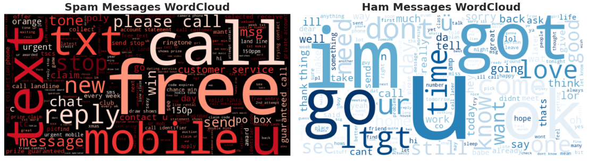

# SMS Spam Detection

This repository contains a machine learning project to detect spam messages in SMS text using Natural Language Processing (NLP) techniques and a Naive Bayes classifier. The project includes text preprocessing, spam vs. ham visualization with word clouds, and model performance evaluation.

## Project Overview

The goal of this project is to classify SMS messages as either "spam" or "ham" (non-spam) using a machine learning approach. We utilize the following steps:

1. **Data Preprocessing:** 
   - Convert messages to lowercase.
   - Remove punctuation and stopwords.
   - Tokenize the text.

2. **Word Cloud Visualization:** 
   - Generate visual word clouds to highlight the most common words in both spam and ham messages.

3. **Model Training:**
   - Train a **Naive Bayes classifier** on the preprocessed data.
   - Use **TF-IDF Vectorization** to convert the text into numerical format.
   
4. **Evaluation:**
   - Evaluate the model using accuracy and a detailed classification report (precision, recall, F1-score).

## Features

- **Word Cloud Visualization**: Get insights into frequently used words in spam and ham messages.
- **Text Preprocessing Pipeline**: Clean and process text data to make it suitable for model training.
- **Naive Bayes Classifier**: Efficiently classify messages using a probabilistic approach.
- **Model Evaluation**: Analyze the accuracy and performance of the classifier using various metrics.

## Installation

1. Clone the repository:

   ```bash
   git clone https://github.com/yourusername/sms-spam-detection.git
   cd sms-spam-detection


## WordCloud


## Dependencies 
- pandas
- scikit-learn
- nltk
- wordcloud
- matplotlib
- seaborn
